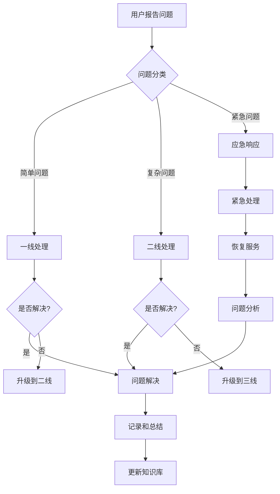
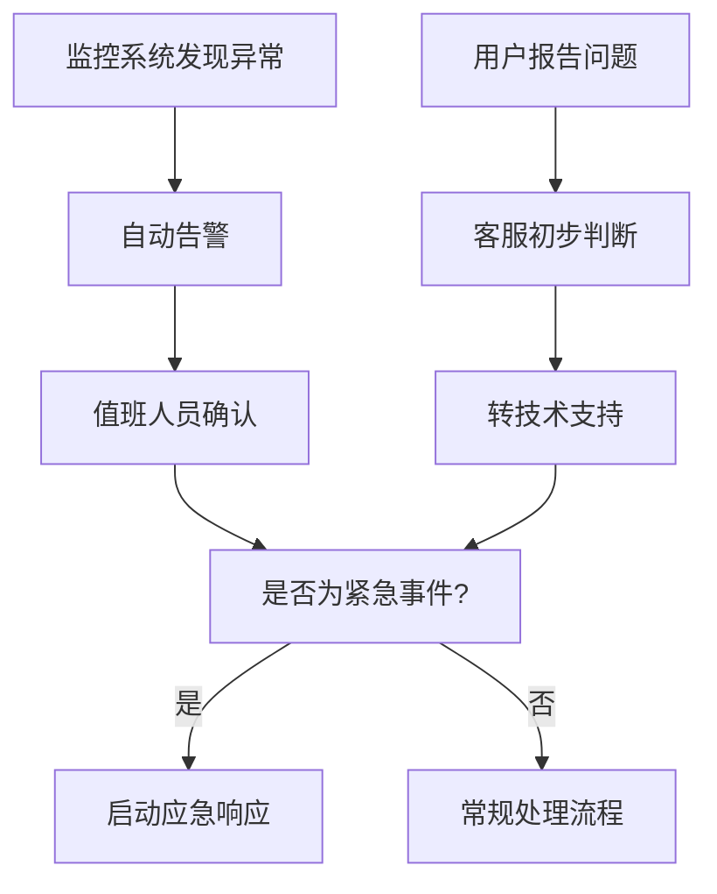
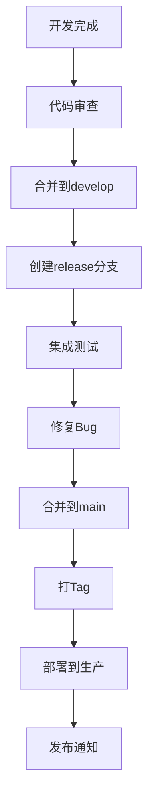

# MR游戏运营管理系统 - 技术支持体系

## 目录
1. [支持体系概述](#支持体系概述)
2. [支持团队结构](#支持团队结构)
3. [支持流程](#支持流程)
4. [问题分类和优先级](#问题分类和优先级)
5. [知识库管理](#知识库管理)
6. [监控和预警](#监控和预警)
7. [应急响应](#应急响应)
8. [性能优化](#性能优化)
9. [版本管理](#版本管理)
10. [质量保证](#质量保证)

---

## 支持体系概述

### 支持目标
- 提供及时、专业的技术支持服务
- 确保系统稳定、高效运行
- 快速响应用户问题和需求
- 持续改进系统质量和用户体验

### 服务承诺
- **响应时间**：30分钟内响应紧急问题
- **解决时间**：24小时内解决一般问题
- **可用性**：99.9%系统可用性保证
- **满意度**：95%以上用户满意度

### 支持范围
- 系统功能支持
- 技术问题解决
- 性能优化建议
- 安全问题处理
- 培训和指导

---

## 支持团队结构

### 团队组成

#### 1. 技术支持经理
**职责**：
- 团队管理和协调
- 支持流程优化
- 客户关系维护
- 服务质量监控

**要求**：
- 5年以上技术支持经验
- 优秀的沟通和管理能力
- 熟悉系统架构和技术栈

#### 2. 一线支持工程师
**职责**：
- 处理日常技术问题
- 用户咨询和指导
- 问题初步诊断
- 升级复杂问题

**要求**：
- 2年以上技术支持经验
- 良好的沟通能力
- 熟悉系统基本操作

#### 3. 二线技术专家
**职责**：
- 处理复杂技术问题
- 系统故障排查
- 性能分析和优化
- 技术方案设计

**要求**：
- 3年以上相关技术经验
- 深入的技术理解
- 问题解决能力强

#### 4. 系统管理员
**职责**：
- 系统监控和维护
- 数据备份和恢复
- 安全管理
- 基础设施管理

**要求**：
- 熟悉Linux/Windows系统管理
- 网络和数据库管理经验
- 安全意识和应急处理能力

### 值班安排

#### 工作时间安排
```
周一至周五：9:00 - 18:00
- 一线支持：2人轮班
- 二线支持：1人待命
- 系统管理：1人值班

周末及节假日：
- 紧急支持：电话轮值
- 系统监控：自动监控 + 人工巡检
```

#### 联系方式
```
紧急支持热线：400-xxx-xxxx
技术支持邮箱：support@mr-gaming.com
在线支持：系统内置聊天
项目管理：Jira/禅道
```

---

## 支持流程

### 问题处理流程



### 具体流程说明

#### 1. 问题接收
- **渠道**：电话、邮件、在线客服、系统反馈
- **登记**：记录问题基本信息
- **分类**：按类型和紧急程度分类
- **分派**：分配给相应支持人员

#### 2. 问题诊断
- **信息收集**：获取详细问题描述
- **环境检查**：检查系统状态和配置
- **日志分析**：查看相关日志文件
- **初步判断**：确定问题原因和影响范围

#### 3. 问题处理
- **解决方案**：制定处理方案
- **实施操作**：执行处理步骤
- **效果验证**：确认问题是否解决
- **用户确认**：通知用户验证结果

#### 4. 问题关闭
- **记录总结**：详细记录处理过程
- **知识更新**：更新到知识库
- **满意度调查**：收集用户反馈
- **问题关闭**：完成处理流程

### 服务级别协议（SLA）

| 问题级别 | 响应时间 | 解决时间 | 通知方式 |
|----------|----------|----------|----------|
| **P1 - 紧急** | 15分钟 | 4小时 | 电话 + 短信 |
| **P2 - 重要** | 30分钟 | 8小时 | 电话 + 邮件 |
| **P3 - 一般** | 2小时 | 24小时 | 邮件 |
| **P4 - 低优先级** | 1工作日 | 5工作日 | 邮件 |

---

## 问题分类和优先级

### 问题分类

#### 1. 系统问题
- **登录问题**：无法登录、认证失败
- **功能异常**：功能不可用、错误提示
- **性能问题**：响应缓慢、卡顿
- **数据问题**：数据丢失、数据错误
- **接口问题**：API调用失败、数据同步

#### 2. 网络问题
- **连接问题**：无法访问、连接超时
- **配置问题**：网络配置错误
- **安全问题**：攻击、病毒、漏洞
- **带宽问题**：网络拥堵、速度慢

#### 3. 数据库问题
- **连接问题**：数据库连接失败
- **性能问题**：查询缓慢、锁表
- **数据问题**：数据不一致、丢失
- **备份问题**：备份失败、恢复失败

#### 4. 应用问题
- **程序错误**：异常退出、崩溃
- **配置问题**：参数配置错误
- **兼容性问题**：浏览器兼容、版本兼容
- **功能问题**：功能缺失、逻辑错误

### 优先级定义

#### P1 - 紧急
**定义**：系统核心功能完全不可用，影响所有用户
**示例**：
- 系统完全无法访问
- 数据库连接失败
- 支付功能异常
- 数据丢失或损坏

#### P2 - 重要
**定义**：系统部分功能异常，影响多数用户
**示例**：
- 某个重要功能模块不可用
- 性能严重下降
- 部分用户无法登录
- 数据同步异常

#### P3 - 一般
**定义**：系统功能正常，但有使用问题
**示例**：
- 界面显示问题
- 非核心功能异常
- 操作不便或体验差
- 报表数据不准确

#### P4 - 低优先级
**定义**：改进建议或非紧急问题
**示例**：
- 功能优化建议
- 界面美化需求
- 文档完善需求
- 新功能需求

---

## 知识库管理

### 知识库结构

#### 1. 常见问题（FAQ）
```
├── 登录认证问题
│   ├── 忘记密码
│   ├── 账户锁定
│   ├── 权限不足
│   └── 认证失败
├── 功能使用问题
│   ├── 用户管理
│   ├── 财务管理
│   ├── 站点管理
│   └── 数据统计
├── 系统问题
│   ├── 性能优化
│   ├── 浏览器兼容
│   ├── 网络问题
│   └── 数据问题
└── 错误代码
    ├── HTTP错误
    ├── 数据库错误
    ├── 业务错误
    └── 系统错误
```

#### 2. 操作指南
```
├── 用户指南
│   ├── 新手入门
│   ├── 基础操作
│   ├── 高级功能
│   └── 最佳实践
├── 管理员指南
│   ├── 系统配置
│   ├── 用户管理
│   ├── 权限设置
│   └── 监控管理
├── 开发者指南
│   ├── API文档
│   ├── 集成指南
│   ├── 错误处理
│   └── 调试技巧
└── 运维指南
    ├── 部署指南
    ├── 监控配置
    ├── 备份恢复
    └── 故障处理
```

#### 3. 故障处理手册
```
├── 应急处理流程
├── 常见故障诊断
├── 系统恢复步骤
├── 数据恢复方法
└── 问题排查工具
```

### 知识库维护

#### 内容更新
- **定期更新**：每月更新一次
- **即时更新**：新问题解决后24小时内
- **版本管理**：记录每次更新内容
- **审核机制**：技术专家审核内容准确性

#### 质量保证
- **准确性检查**：定期验证解决方案
- **完整性检查**：确保覆盖所有常见问题
- **易用性优化**：简化描述，添加截图
- **搜索优化**：改进关键词和分类

#### 使用统计
- **访问统计**：记录知识库使用情况
- **效果评估**：评估解决方案有效性
- **用户反馈**：收集用户改进建议
- **内容优化**：根据统计数据优化内容

---

## 监控和预警

### 监控体系

#### 1. 系统监控
```yaml
基础设施监控:
  - CPU使用率
  - 内存使用率
  - 磁盘空间
  - 网络流量
  - 系统负载

应用监控:
  - 服务可用性
  - 响应时间
  - 错误率
  - 并发用户数
  - 业务指标

数据库监控:
  - 连接数
  - 查询性能
  - 锁等待
  - 缓存命中率
  - 备份状态

安全监控:
  - 登录异常
  - 权限变更
  - 数据访问
  - 攻击检测
  - 漏洞扫描
```

#### 2. 业务监控
```yaml
用户行为监控:
  - 登录统计
  - 功能使用
  - 操作路径
  - 异常行为

业务指标监控:
  - 用户增长
  - 交易量
  - 收入统计
  - 转化率

服务质量监控:
  - 响应时间
  - 解决率
  - 满意度
  - 投诉率
```

### 预警机制

#### 预警级别
- **严重**：系统完全不可用，立即通知
- **警告**：系统性能下降，1小时内通知
- **提醒**：潜在风险，24小时内通知
- **信息**：一般信息，定期报告

#### 通知方式
```
严重预警:
  - 电话通知（所有相关人员）
  - 短信通知（值班人员）
  - 邮件通知（管理层）
  - 系统内弹窗

警告预警:
  - 邮件通知（技术团队）
  - 即时消息（值班人员）
  - 监控面板告警

提醒预警:
  - 邮件通知（相关负责人）
  - 监控面板提示

信息预警:
  - 定期报告
  - 监控面板显示
```

#### 自动化响应
```python
# 自动化响应示例
def auto_response(alert):
    if alert.level == 'CRITICAL':
        # 自动重启服务
        restart_service(alert.service)
        # 发送紧急通知
        send_emergency_notification(alert)
    elif alert.level == 'WARNING':
        # 自动扩容
        scale_up_resources(alert.resource)
        # 发送预警通知
        send_warning_notification(alert)
```

---

## 应急响应

### 应急响应流程

#### 1. 事件发现和报告


#### 2. 应急响应启动
- **响应时间**：15分钟内启动响应
- **响应团队**：技术支持经理、系统管理员、开发负责人
- **响应方式**：电话会议、现场处理、远程协作

#### 3. 问题诊断和处理
- **快速诊断**：确定问题影响范围和严重程度
- **临时措施**：采取临时措施恢复服务
- **根本解决**：找到问题根本原因并解决
- **验证测试**：确保问题完全解决

#### 4. 恢复和验证
- **服务恢复**：逐步恢复所有受影响的服务
- **功能验证**：验证所有功能正常工作
- **数据验证**：确认数据完整性和一致性
- **用户通知**：通知用户服务已恢复

#### 5. 事后总结
- **问题分析**：详细分析问题原因和影响
- **处理总结**：总结处理过程和经验教训
- **改进措施**：制定预防措施
- **文档更新**：更新相关文档和知识库

### 应急预案

#### 1. 系统完全不可用
```yaml
应急预案:
  立即响应:
    - 值班人员确认问题
    - 启动应急响应团队
    - 评估影响范围

  临时措施:
    - 切换到备用系统
    - 启用灾备方案
    - 通知用户状态

  根本解决:
    - 诊断问题原因
    - 修复系统故障
    - 恢复正常服务

  预防措施:
    - 完善监控系统
    - 加强备份策略
    - 定期演练测试
```

#### 2. 数据库故障
```yaml
应急预案:
  立即响应:
    - 停止应用写入
    - 切换到只读模式
    - 评估数据损失

  数据恢复:
    - 使用最近备份恢复
    - 应用增量日志
    - 验证数据一致性

  服务恢复:
    - 重启数据库服务
    - 恢复应用连接
    - 监控系统状态

  预防措施:
    - 增加备份频率
    - 实施主从复制
    - 加强监控告警
```

#### 3. 安全事件
```yaml
应急预案:
  立即响应:
    - 隔离受影响系统
    - 停止相关服务
    - 通知安全团队

  事件调查:
    - 收集证据
    - 分析攻击路径
    - 评估损失程度

  系统恢复:
    - 清理恶意代码
    - 修复安全漏洞
    - 恢复系统服务

  预防措施:
    - 加强安全防护
    - 更新安全策略
    - 进行安全培训
```

---

## 性能优化

### 性能监控

#### 1. 关键指标
```yaml
系统性能:
  - 响应时间：< 2秒
  - 并发用户数：> 1000
  - CPU使用率：< 70%
  - 内存使用率：< 80%
  - 磁盘I/O：< 80%

应用性能:
  - 页面加载时间：< 3秒
  - API响应时间：< 500ms
  - 数据库查询时间：< 100ms
  - 缓存命中率：> 90%
  - 错误率：< 0.1%

业务性能:
  - 用户登录成功率：> 99.9%
  - 交易成功率：> 99.5%
  - 数据处理延迟：< 1分钟
  - 报表生成时间：< 30秒
```

#### 2. 监控工具
- **APM工具**：New Relic, AppDynamics
- **日志分析**：ELK Stack, Splunk
- **性能分析**：JProfiler, VisualVM
- **网络监控**：Wireshark, Pingdom

### 优化策略

#### 1. 系统优化
```yaml
硬件优化:
  - 增加服务器配置
  - 优化网络带宽
  - 使用SSD存储
  - 配置负载均衡

软件优化:
  - 优化数据库查询
  - 增加缓存策略
  - 代码性能优化
  - 配置参数调优

架构优化:
  - 微服务拆分
  - 数据库分库分表
  - CDN加速
  - 异步处理
```

#### 2. 应用优化
```yaml
前端优化:
  - 资源压缩合并
  - 图片优化
  - 懒加载
  - 缓存策略

后端优化:
  - 数据库优化
  - 缓存策略
  - 连接池优化
  - 异步处理

数据库优化:
  - 索引优化
  - 查询优化
  - 分库分表
  - 读写分离
```

---

## 版本管理

### 版本控制策略

#### 1. 分支管理
```
main (生产分支)
├── develop (开发分支)
│   ├── feature/user-management (功能分支)
│   ├── feature/payment-system (功能分支)
│   └── feature/dashboard (功能分支)
├── release/v1.1.0 (发布分支)
└── hotfix/critical-bug (热修复分支)
```

#### 2. 版本命名规范
```
主版本号.次版本号.修订号 (如：1.2.3)
- 主版本号：重大功能变更或架构调整
- 次版本号：新功能发布
- 修订号：Bug修复和优化

预发布版本：
- alpha：内部测试版本
- beta：公开测试版本
- rc：发布候选版本
```

#### 3. 发布流程


### 变更管理

#### 1. 变更类型
- **紧急变更**：安全漏洞、系统故障
- **标准变更**：功能更新、性能优化
- **一般变更**：配置调整、文档更新

#### 2. 变更流程
```
变更申请
├── 变更描述
├── 变更原因
├── 影响分析
├── 实施计划
├── 回滚方案
└── 风险评估

变更审批
├── 技术评审
├── 业务评审
├── 风险评估
└── 最终批准

变更实施
├── 准备工作
├── 实施变更
├── 验证测试
└── 监控观察

变更关闭
├── 效果评估
├── 文档更新
├── 经验总结
└── 变更关闭
```

---

## 质量保证

### 质量标准

#### 1. 可用性标准
- **系统可用性**：99.9%（年停机时间 < 8.76小时）
- **故障恢复时间**：< 1小时
- **数据完整性**：99.99%
- **备份成功率**：100%

#### 2. 性能标准
- **响应时间**：95%的请求 < 2秒
- **并发支持**：1000+并发用户
- **数据处理**：实时处理，延迟 < 1分钟
- **报表生成**：复杂报表 < 30秒

#### 3. 安全标准
- **数据加密**：传输和存储加密
- **访问控制**：基于角色的权限控制
- **安全审计**：完整的操作日志
- **漏洞修复**：高危漏洞24小时内修复

### 质量控制

#### 1. 测试策略
```yaml
单元测试:
  - 代码覆盖率 > 80%
  - 核心逻辑 100% 覆盖
  - 自动化执行

集成测试:
  - API接口测试
  - 数据库集成测试
  - 第三方服务测试

系统测试:
  - 功能测试
  - 性能测试
  - 安全测试
  - 兼容性测试

用户验收测试:
  - 业务流程测试
  - 用户体验测试
  - 压力测试
```

#### 2. 代码审查
- **审查标准**：编码规范、性能、安全、可维护性
- **审查流程**：开发者自检 → 同事审查 → 专家审查
- **审查工具**：GitLab CI/CD、SonarQube、CodeClimate

#### 3. 持续改进
- **质量指标**：缺陷密度、修复时间、用户满意度
- **改进措施**：流程优化、工具升级、培训提升
- **定期评估**：月度质量报告、季度改进计划

---

## 附录

### A. 联系信息

```
技术支持热线：400-xxx-xxxx
技术支持邮箱：support@mr-gaming.com
紧急联系电话：186-xxxx-xxxx
项目经理电话：138-xxxx-xxxx
```

### B. 相关文档
- [用户培训手册](user_training_manual.md)
- [系统运维手册](system_operations_manual.md)
- [API开发文档](api_development_guide.md)
- [安全配置指南](security_configuration_guide.md)

### C. 工具和资源
- **项目管理**：Jira、禅道
- **文档协作**：Confluence、GitBook
- **监控工具**：Prometheus、Grafana
- **日志分析**：ELK Stack、Splunk
- **CI/CD**：GitLab CI、Jenkins

---

**文档版本**：v1.0
**更新日期**：2025-10-22
**维护团队**：MR游戏运营管理系统技术支持部