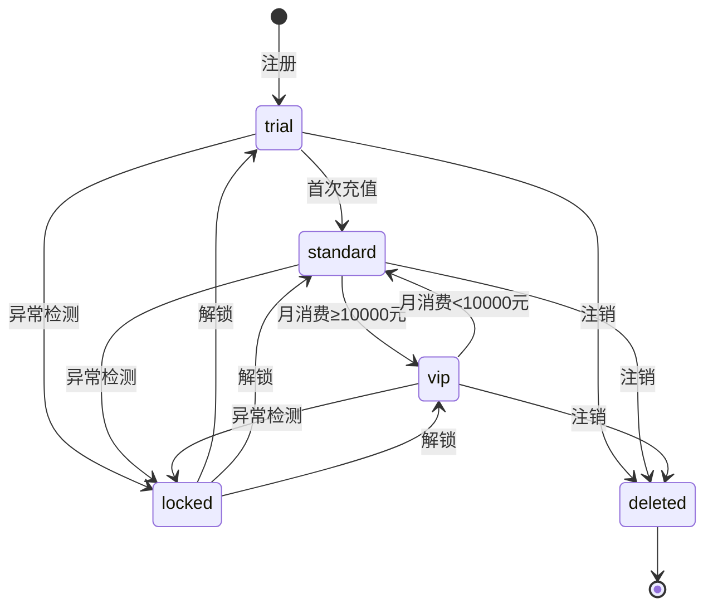
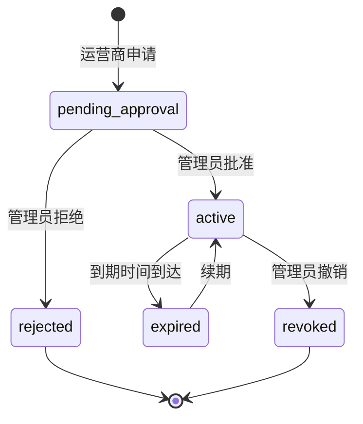
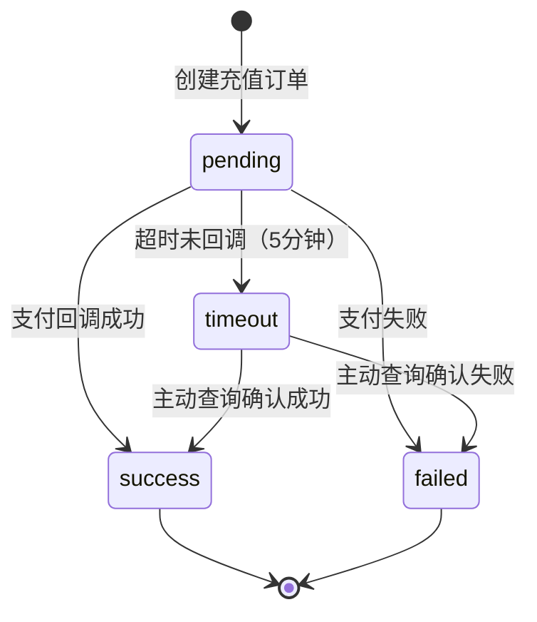
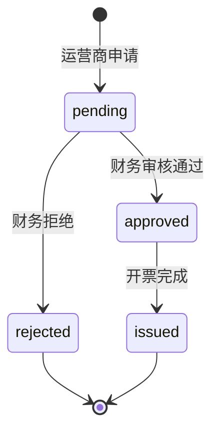
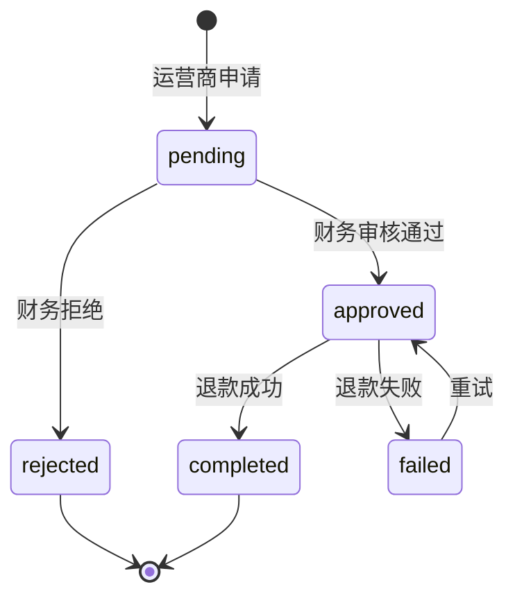
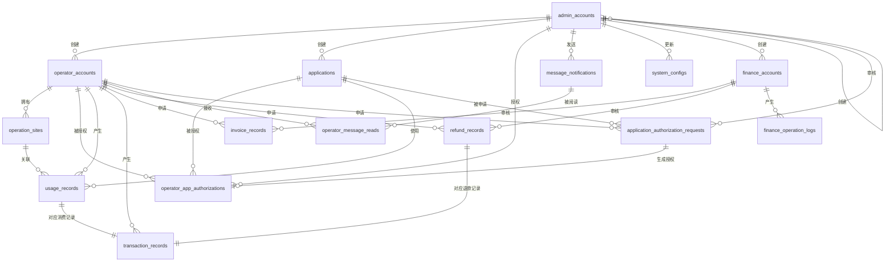

# Data Model: MR游戏运营管理系统

**Version**: 1.0.0
**Date**: 2025-10-10
**Related**: [spec.md](./spec.md) | [plan.md](./plan.md)

## 概述

本文档定义MR游戏运营管理系统的完整数据模型，包括14个核心实体的表结构、关系、约束和索引设计。数据模型基于PostgreSQL 14+，使用SQLAlchemy 2.0作为ORM框架。

### 设计原则

- **零硬编码**: 所有业务配置（如余额阈值、会话保持时间）存储在system_config表
- **审计完整性**: 所有关键操作记录创建人、更新人、操作IP和时间戳
- **软删除策略**: 核心业务实体（运营商、运营点）使用逻辑删除，保留历史数据以满足合规要求
- **财务精确性**: 金额字段使用DECIMAL(10, 2)，支持千万级金额且精确到分
- **并发安全**: 余额扣费使用行级锁（SELECT FOR UPDATE）确保并发一致性
- **性能优化**: 高频查询字段建立复合索引，审计日志表使用分区表（按月分区）

---

## 1. 运营商账户 (operator_accounts)

**用途**: 系统的核心付费客户，负责运营MR游戏业务

### 字段定义

| 字段名 | 类型 | 约束 | 默认值 | 说明 |
|--------|------|------|--------|------|
| id | UUID | PK | uuid_generate_v4() | 主键 |
| username | VARCHAR(64) | NOT NULL, UNIQUE | - | 登录用户名，全局唯一 |
| full_name | VARCHAR(128) | NOT NULL | - | 真实姓名或公司名称 |
| phone | VARCHAR(32) | NOT NULL | - | 联系电话 |
| email | VARCHAR(128) | NOT NULL | - | 邮箱地址 |
| password_hash | VARCHAR(255) | NOT NULL | - | 密码哈希（bcrypt） |
| api_key | VARCHAR(64) | NOT NULL, UNIQUE | - | 头显Server身份认证密钥 |
| api_key_hash | VARCHAR(255) | NOT NULL | - | API Key哈希值（用于验证） |
| balance | DECIMAL(10, 2) | NOT NULL | 0.00 | 账户余额（单位：元） |
| customer_tier | VARCHAR(32) | NOT NULL | 'trial' | 客户分类：vip/standard/trial |
| is_active | BOOLEAN | NOT NULL | true | 账户状态：true=正常，false=已注销 |
| is_locked | BOOLEAN | NOT NULL | false | 账户锁定状态（用于异常检测） |
| locked_reason | TEXT | NULL | NULL | 锁定原因说明 |
| locked_at | TIMESTAMP WITH TIME ZONE | NULL | NULL | 锁定时间 |
| last_login_at | TIMESTAMP WITH TIME ZONE | NULL | NULL | 最近登录时间 |
| last_login_ip | VARCHAR(64) | NULL | NULL | 最近登录IP |
| created_at | TIMESTAMP WITH TIME ZONE | NOT NULL | CURRENT_TIMESTAMP | 创建时间 |
| updated_at | TIMESTAMP WITH TIME ZONE | NOT NULL | CURRENT_TIMESTAMP | 更新时间 |
| deleted_at | TIMESTAMP WITH TIME ZONE | NULL | NULL | 删除时间（软删除） |

### 关系

- 与**运营点**的关系：1:N（一个运营商拥有多个运营点）
- 与**运营者应用授权**的关系：1:N（一个运营商有多个应用授权）
- 与**使用记录**的关系：1:N（一个运营商产生多条使用记录）
- 与**交易记录**的关系：1:N（一个运营商有多条交易记录）
- 与**消息通知**的关系：N:M（通过中间表实现消息接收关系）

### 索引

- **PRIMARY KEY**: id
- **UNIQUE**: uq_operator_username ON (username) WHERE deleted_at IS NULL
- **UNIQUE**: uq_operator_api_key ON (api_key) WHERE deleted_at IS NULL
- **INDEX**: idx_operator_email ON (email) - 用于邮箱查询
- **INDEX**: idx_operator_tier ON (customer_tier, is_active) - 用于客户分类统计
- **INDEX**: idx_operator_balance ON (balance) WHERE balance < 100 - 用于余额不足提醒

### 约束

- **CHECK**: chk_balance_non_negative CHECK (balance >= 0) - 确保余额非负
- **CHECK**: chk_customer_tier CHECK (customer_tier IN ('vip', 'standard', 'trial')) - 客户分类枚举
- **NOT NULL**: username, full_name, phone, email, password_hash, api_key, api_key_hash, balance, customer_tier

### 状态机



### 示例数据

```json
{
  "id": "550e8400-e29b-41d4-a716-446655440000",
  "username": "beijing_vr_center",
  "full_name": "北京星际VR体验中心",
  "phone": "13800138000",
  "email": "contact@beijingvr.com",
  "password_hash": "$2b$12$LQv3c1yqBWVHxkd0LHAkCOYz6TtxMQJqhN8/LewY5GyYqP.fODZRm",
  "api_key": "a1b2c3d4e5f6g7h8i9j0k1l2m3n4o5p6q7r8s9t0u1v2w3x4y5z6a7b8c9d0e1f2",
  "api_key_hash": "$2b$12$...",
  "balance": 5280.50,
  "customer_tier": "vip",
  "is_active": true,
  "is_locked": false,
  "locked_reason": null,
  "locked_at": null,
  "last_login_at": "2025-10-10T09:30:00+08:00",
  "last_login_ip": "203.0.113.42",
  "created_at": "2025-01-15T14:20:00+08:00",
  "updated_at": "2025-10-10T09:30:00+08:00",
  "deleted_at": null
}
```

---

## 2. 运营点 (operation_sites)

**用途**: 运营商的线下门店或业务单元，每个运营点关联一个头显Server

### 字段定义

| 字段名 | 类型 | 约束 | 默认值 | 说明 |
|--------|------|------|--------|------|
| id | UUID | PK | uuid_generate_v4() | 主键 |
| operator_id | UUID | FK, NOT NULL | - | 所属运营商ID |
| name | VARCHAR(128) | NOT NULL | - | 运营点名称 |
| address | TEXT | NOT NULL | - | 详细地址 |
| description | TEXT | NULL | NULL | 运营点描述 |
| contact_person | VARCHAR(64) | NULL | NULL | 现场负责人 |
| contact_phone | VARCHAR(32) | NULL | NULL | 现场联系电话 |
| server_identifier | VARCHAR(128) | NULL | NULL | 头显Server设备标识符 |
| is_active | BOOLEAN | NOT NULL | true | 运营点状态 |
| created_at | TIMESTAMP WITH TIME ZONE | NOT NULL | CURRENT_TIMESTAMP | 创建时间 |
| updated_at | TIMESTAMP WITH TIME ZONE | NOT NULL | CURRENT_TIMESTAMP | 更新时间 |
| deleted_at | TIMESTAMP WITH TIME ZONE | NULL | NULL | 删除时间（软删除） |

### 关系

- 与**运营商账户**的关系：N:1（多个运营点属于一个运营商），外键: operator_id
- 与**使用记录**的关系：1:N（一个运营点产生多条使用记录）

### 索引

- **PRIMARY KEY**: id
- **INDEX**: idx_site_operator ON (operator_id, is_active) - 用于查询运营商的活跃运营点
- **INDEX**: idx_site_name ON (name) - 用于名称搜索
- **INDEX**: idx_site_server ON (server_identifier) WHERE server_identifier IS NOT NULL - 用于Server关联查询

### 约束

- **FOREIGN KEY**: fk_site_operator FOREIGN KEY (operator_id) REFERENCES operator_accounts(id) ON DELETE RESTRICT
- **NOT NULL**: operator_id, name, address

### 示例数据

```json
{
  "id": "660e8400-e29b-41d4-a716-446655440001",
  "operator_id": "550e8400-e29b-41d4-a716-446655440000",
  "name": "北京朝阳门店",
  "address": "北京市朝阳区建国路88号SOHO现代城B座3层",
  "description": "朝阳区旗舰店，面积300平米，配备8台头显设备",
  "contact_person": "张三",
  "contact_phone": "13900139000",
  "server_identifier": "HMD-SERVER-BJ-001",
  "is_active": true,
  "created_at": "2025-01-20T10:00:00+08:00",
  "updated_at": "2025-10-10T09:00:00+08:00",
  "deleted_at": null
}
```

---

## 3. 应用 (applications)

**用途**: 可授权的MR游戏应用，定义游戏的基础信息和定价规则

### 字段定义

| 字段名 | 类型 | 约束 | 默认值 | 说明 |
|--------|------|------|--------|------|
| id | UUID | PK | uuid_generate_v4() | 主键 |
| app_code | VARCHAR(64) | NOT NULL, UNIQUE | - | 应用唯一标识符（用于API调用） |
| app_name | VARCHAR(128) | NOT NULL | - | 应用名称 |
| description | TEXT | NULL | NULL | 应用描述 |
| price_per_player | DECIMAL(10, 2) | NOT NULL | - | 单人价格（单位：元） |
| min_players | INTEGER | NOT NULL | - | 最小玩家数 |
| max_players | INTEGER | NOT NULL | - | 最大玩家数 |
| is_active | BOOLEAN | NOT NULL | true | 应用状态（下架后不可新授权） |
| created_at | TIMESTAMP WITH TIME ZONE | NOT NULL | CURRENT_TIMESTAMP | 创建时间 |
| updated_at | TIMESTAMP WITH TIME ZONE | NOT NULL | CURRENT_TIMESTAMP | 更新时间 |
| created_by | UUID | FK, NULL | NULL | 创建者（管理员ID） |

### 关系

- 与**运营者应用授权**的关系：1:N（一个应用可授权给多个运营商）
- 与**使用记录**的关系：1:N（一个应用产生多条使用记录）
- 与**管理员账号**的关系：N:1（多个应用由一个管理员创建），外键: created_by

### 索引

- **PRIMARY KEY**: id
- **UNIQUE**: uq_app_code ON (app_code)
- **INDEX**: idx_app_name ON (app_name) - 用于名称搜索
- **INDEX**: idx_app_active ON (is_active) - 用于查询活跃应用
- **INDEX**: idx_app_price ON (price_per_player) - 用于价格统计

### 约束

- **CHECK**: chk_price_positive CHECK (price_per_player > 0) - 确保价格为正数
- **CHECK**: chk_players_range CHECK (min_players >= 1 AND max_players >= min_players AND max_players <= 100) - 玩家数范围合理性
- **FOREIGN KEY**: fk_app_creator FOREIGN KEY (created_by) REFERENCES admin_accounts(id) ON DELETE SET NULL
- **NOT NULL**: app_code, app_name, price_per_player, min_players, max_players

### 示例数据

```json
{
  "id": "770e8400-e29b-41d4-a716-446655440002",
  "app_code": "space_adventure_2024",
  "app_name": "太空探险",
  "description": "沉浸式太空探索VR游戏，支持2-8人联机协作",
  "price_per_player": 10.00,
  "min_players": 2,
  "max_players": 8,
  "is_active": true,
  "created_at": "2024-12-01T09:00:00+08:00",
  "updated_at": "2025-10-01T10:00:00+08:00",
  "created_by": "880e8400-e29b-41d4-a716-446655440003"
}
```

---

## 4. 运营者应用授权 (operator_app_authorizations)

**用途**: 管理运营商对应用的授权关系，控制运营商可使用的应用范围

### 字段定义

| 字段名 | 类型 | 约束 | 默认值 | 说明 |
|--------|------|------|--------|------|
| id | UUID | PK | uuid_generate_v4() | 主键 |
| operator_id | UUID | FK, NOT NULL | - | 运营商ID |
| application_id | UUID | FK, NOT NULL | - | 应用ID |
| authorized_at | TIMESTAMP WITH TIME ZONE | NOT NULL | CURRENT_TIMESTAMP | 授权时间 |
| expires_at | TIMESTAMP WITH TIME ZONE | NULL | NULL | 授权到期时间（NULL表示永久授权） |
| authorized_by | UUID | FK, NULL | NULL | 授权审批人（管理员ID） |
| application_request_id | UUID | FK, NULL | NULL | 关联的申请记录ID（如通过申请授权） |
| is_active | BOOLEAN | NOT NULL | true | 授权状态 |
| created_at | TIMESTAMP WITH TIME ZONE | NOT NULL | CURRENT_TIMESTAMP | 创建时间 |
| updated_at | TIMESTAMP WITH TIME ZONE | NOT NULL | CURRENT_TIMESTAMP | 更新时间 |

### 关系

- 与**运营商账户**的关系：N:1（多个授权属于一个运营商），外键: operator_id
- 与**应用**的关系：N:1（多个授权指向一个应用），外键: application_id
- 与**管理员账号**的关系：N:1（多个授权由一个管理员批准），外键: authorized_by
- 与**应用授权申请**的关系：N:1（可选关联），外键: application_request_id

### 索引

- **PRIMARY KEY**: id
- **UNIQUE**: uq_operator_app ON (operator_id, application_id) WHERE is_active = true
- **INDEX**: idx_auth_operator ON (operator_id, is_active) - 用于查询运营商授权列表
- **INDEX**: idx_auth_application ON (application_id, is_active) - 用于统计应用授权数量
- **INDEX**: idx_auth_expiry ON (expires_at) WHERE expires_at IS NOT NULL - 用于授权到期提醒

### 约束

- **FOREIGN KEY**: fk_auth_operator FOREIGN KEY (operator_id) REFERENCES operator_accounts(id) ON DELETE CASCADE
- **FOREIGN KEY**: fk_auth_application FOREIGN KEY (application_id) REFERENCES applications(id) ON DELETE RESTRICT
- **FOREIGN KEY**: fk_auth_admin FOREIGN KEY (authorized_by) REFERENCES admin_accounts(id) ON DELETE SET NULL
- **CHECK**: chk_expiry_future CHECK (expires_at IS NULL OR expires_at > authorized_at) - 确保到期时间晚于授权时间
- **NOT NULL**: operator_id, application_id

### 状态机



### 示例数据

```json
{
  "id": "990e8400-e29b-41d4-a716-446655440004",
  "operator_id": "550e8400-e29b-41d4-a716-446655440000",
  "application_id": "770e8400-e29b-41d4-a716-446655440002",
  "authorized_at": "2025-01-20T11:00:00+08:00",
  "expires_at": null,
  "authorized_by": "880e8400-e29b-41d4-a716-446655440003",
  "application_request_id": null,
  "is_active": true,
  "created_at": "2025-01-20T11:00:00+08:00",
  "updated_at": "2025-01-20T11:00:00+08:00"
}
```

---

## 5. 使用记录 (usage_records)

**用途**: 记录每次游戏会话的详细信息，用于统计分析和财务审计

### 字段定义

| 字段名 | 类型 | 约束 | 默认值 | 说明 |
|--------|------|------|--------|------|
| id | UUID | PK | uuid_generate_v4() | 主键 |
| session_id | VARCHAR(128) | NOT NULL, UNIQUE | - | 游戏会话ID（防重复扣费），长度1-255字符，推荐使用UUID v4格式 |
| operator_id | UUID | FK, NOT NULL | - | 运营商ID |
| site_id | UUID | FK, NOT NULL | - | 运营点ID |
| application_id | UUID | FK, NOT NULL | - | 应用ID |
| player_count | INTEGER | NOT NULL | - | 玩家数量 |
| price_per_player | DECIMAL(10, 2) | NOT NULL | - | 单人价格快照（历史价格） |
| total_cost | DECIMAL(10, 2) | NOT NULL | - | 总费用 = player_count × price_per_player |
| authorization_token | VARCHAR(64) | NOT NULL | - | 授权令牌（返回给头显Server） |
| game_started_at | TIMESTAMP WITH TIME ZONE | NOT NULL | CURRENT_TIMESTAMP | 游戏启动时间 |
| game_duration_minutes | INTEGER | NULL | NULL | 游戏时长（分钟，头显Server上报） |
| game_ended_at | TIMESTAMP WITH TIME ZONE | NULL | NULL | 游戏结束时间（头显Server上报） |
| client_ip | VARCHAR(64) | NULL | NULL | 请求来源IP |
| created_at | TIMESTAMP WITH TIME ZONE | NOT NULL | CURRENT_TIMESTAMP | 创建时间 |

### 关系

- 与**运营商账户**的关系：N:1，外键: operator_id
- 与**运营点**的关系：N:1，外键: site_id
- 与**应用**的关系：N:1，外键: application_id
- 与**交易记录**的关系：1:1（每条使用记录对应一条消费交易记录）

### 索引

- **PRIMARY KEY**: id
- **UNIQUE**: uq_session_id ON (session_id)
- **INDEX**: idx_usage_operator ON (operator_id, game_started_at DESC) - 用于查询运营商使用记录
- **INDEX**: idx_usage_site ON (site_id, game_started_at DESC) - 用于按运营点统计
- **INDEX**: idx_usage_application ON (application_id, game_started_at DESC) - 用于按应用统计
- **INDEX**: idx_usage_date ON (game_started_at) - 用于时间范围查询
- **INDEX**: idx_usage_cost ON (total_cost) - 用于消费统计

### 约束

- **FOREIGN KEY**: fk_usage_operator FOREIGN KEY (operator_id) REFERENCES operator_accounts(id) ON DELETE RESTRICT
- **FOREIGN KEY**: fk_usage_site FOREIGN KEY (site_id) REFERENCES operation_sites(id) ON DELETE RESTRICT
- **FOREIGN KEY**: fk_usage_application FOREIGN KEY (application_id) REFERENCES applications(id) ON DELETE RESTRICT
- **CHECK**: chk_player_count_positive CHECK (player_count > 0) - 确保玩家数大于0
- **CHECK**: chk_total_cost CHECK (total_cost = player_count * price_per_player) - 确保费用计算正确
- **CHECK**: chk_game_duration CHECK (game_duration_minutes IS NULL OR game_duration_minutes > 0) - 游戏时长为正数
- **NOT NULL**: session_id, operator_id, site_id, application_id, player_count, price_per_player, total_cost, authorization_token

### 示例数据

```json
{
  "id": "aa0e8400-e29b-41d4-a716-446655440005",
  "session_id": "7c9e6679-7425-40de-944b-e07fc1f90ae7",
  "operator_id": "550e8400-e29b-41d4-a716-446655440000",
  "site_id": "660e8400-e29b-41d4-a716-446655440001",
  "application_id": "770e8400-e29b-41d4-a716-446655440002",
  "player_count": 5,
  "price_per_player": 10.00,
  "total_cost": 50.00,
  "authorization_token": "auth_bb0e8400e29b41d4a716446655440006",
  "game_started_at": "2025-10-10T14:30:00+08:00",
  "game_duration_minutes": 45,
  "game_ended_at": "2025-10-10T15:15:00+08:00",
  "client_ip": "203.0.113.42",
  "created_at": "2025-10-10T14:30:00+08:00"
}
```

---

## 6. 交易记录 (transaction_records)

**用途**: 记录所有资金流动（充值和消费），用于财务审计和对账

### 字段定义

| 字段名 | 类型 | 约束 | 默认值 | 说明 |
|--------|------|------|--------|------|
| id | UUID | PK | uuid_generate_v4() | 主键 |
| operator_id | UUID | FK, NOT NULL | - | 运营商ID |
| transaction_type | VARCHAR(32) | NOT NULL | - | 交易类型：recharge/consumption/refund |
| amount | DECIMAL(10, 2) | NOT NULL | - | 交易金额（充值和退款为正，消费为负） |
| balance_before | DECIMAL(10, 2) | NOT NULL | - | 交易前余额 |
| balance_after | DECIMAL(10, 2) | NOT NULL | - | 交易后余额 |
| related_usage_id | UUID | FK, NULL | NULL | 关联使用记录ID（消费类型） |
| related_refund_id | UUID | FK, NULL | NULL | 关联退款记录ID（退款类型） |
| payment_channel | VARCHAR(32) | NULL | NULL | 支付渠道：wechat/alipay（充值类型） |
| payment_order_no | VARCHAR(128) | NULL | NULL | 支付平台订单号 |
| payment_status | VARCHAR(32) | NULL | NULL | 支付状态：pending/success/failed |
| payment_callback_at | TIMESTAMP WITH TIME ZONE | NULL | NULL | 支付回调时间 |
| description | TEXT | NULL | NULL | 交易描述 |
| created_at | TIMESTAMP WITH TIME ZONE | NOT NULL | CURRENT_TIMESTAMP | 创建时间 |

### 关系

- 与**运营商账户**的关系：N:1，外键: operator_id
- 与**使用记录**的关系：N:1（可选，仅消费类型），外键: related_usage_id
- 与**退款记录**的关系：N:1（可选，仅退款类型），外键: related_refund_id

### 索引

- **PRIMARY KEY**: id
- **INDEX**: idx_trans_operator ON (operator_id, created_at DESC) - 用于查询运营商交易记录
- **INDEX**: idx_trans_type ON (transaction_type, created_at DESC) - 用于按类型统计
- **INDEX**: idx_trans_payment ON (payment_order_no) WHERE payment_order_no IS NOT NULL - 用于支付回调查询
- **INDEX**: idx_trans_date ON (created_at) - 用于时间范围查询

### 约束

- **FOREIGN KEY**: fk_trans_operator FOREIGN KEY (operator_id) REFERENCES operator_accounts(id) ON DELETE RESTRICT
- **FOREIGN KEY**: fk_trans_usage FOREIGN KEY (related_usage_id) REFERENCES usage_records(id) ON DELETE SET NULL
- **FOREIGN KEY**: fk_trans_refund FOREIGN KEY (related_refund_id) REFERENCES refund_records(id) ON DELETE SET NULL
- **CHECK**: chk_trans_type CHECK (transaction_type IN ('recharge', 'consumption', 'refund')) - 交易类型枚举
- **CHECK**: chk_payment_channel CHECK (payment_channel IS NULL OR payment_channel IN ('wechat', 'alipay')) - 支付渠道枚举
- **CHECK**: chk_payment_status CHECK (payment_status IS NULL OR payment_status IN ('pending', 'success', 'failed')) - 支付状态枚举
- **CHECK**: chk_balance_calc CHECK (balance_after = balance_before + amount) - 确保余额计算正确
- **NOT NULL**: operator_id, transaction_type, amount, balance_before, balance_after

### 状态机（充值交易）



### 示例数据

```json
{
  "id": "cc0e8400-e29b-41d4-a716-446655440007",
  "operator_id": "550e8400-e29b-41d4-a716-446655440000",
  "transaction_type": "consumption",
  "amount": -50.00,
  "balance_before": 5330.50,
  "balance_after": 5280.50,
  "related_usage_id": "aa0e8400-e29b-41d4-a716-446655440005",
  "related_refund_id": null,
  "payment_channel": null,
  "payment_order_no": null,
  "payment_status": null,
  "payment_callback_at": null,
  "description": "游戏消费：太空探险 - 5人 - 北京朝阳门店",
  "created_at": "2025-10-10T14:30:00+08:00"
}
```

---

## 7. 发票记录 (invoice_records)

**用途**: 管理运营商的发票申请和开具记录

### 字段定义

| 字段名 | 类型 | 约束 | 默认值 | 说明 |
|--------|------|------|--------|------|
| id | UUID | PK | uuid_generate_v4() | 主键 |
| operator_id | UUID | FK, NOT NULL | - | 申请运营商ID |
| invoice_type | VARCHAR(32) | NOT NULL | - | 发票类型：vat_normal/vat_special |
| invoice_amount | DECIMAL(10, 2) | NOT NULL | - | 开票金额 |
| invoice_title | VARCHAR(128) | NOT NULL | - | 发票抬头 |
| tax_id | VARCHAR(32) | NOT NULL | - | 税号 |
| bank_name | VARCHAR(128) | NULL | NULL | 开户银行（专票必填） |
| bank_account | VARCHAR(64) | NULL | NULL | 银行账号（专票必填） |
| company_address | TEXT | NULL | NULL | 公司地址（专票必填） |
| company_phone | VARCHAR(32) | NULL | NULL | 公司电话（专票必填） |
| status | VARCHAR(32) | NOT NULL | 'pending' | 状态：pending/approved/rejected/issued |
| requested_at | TIMESTAMP WITH TIME ZONE | NOT NULL | CURRENT_TIMESTAMP | 申请时间 |
| reviewed_at | TIMESTAMP WITH TIME ZONE | NULL | NULL | 审核时间 |
| reviewed_by | UUID | FK, NULL | NULL | 审核人（财务账号ID） |
| reject_reason | TEXT | NULL | NULL | 拒绝原因 |
| invoice_number | VARCHAR(64) | NULL | NULL | 发票号码（开票后） |
| invoice_file_url | TEXT | NULL | NULL | 电子发票PDF下载链接 |
| issued_at | TIMESTAMP WITH TIME ZONE | NULL | NULL | 开票时间 |
| created_at | TIMESTAMP WITH TIME ZONE | NOT NULL | CURRENT_TIMESTAMP | 创建时间 |
| updated_at | TIMESTAMP WITH TIME ZONE | NOT NULL | CURRENT_TIMESTAMP | 更新时间 |

### 关系

- 与**运营商账户**的关系：N:1，外键: operator_id
- 与**财务账号**的关系：N:1（审核人），外键: reviewed_by

### 索引

- **PRIMARY KEY**: id
- **INDEX**: idx_invoice_operator ON (operator_id, requested_at DESC) - 用于查询运营商发票记录
- **INDEX**: idx_invoice_status ON (status, requested_at DESC) - 用于查询待审核发票
- **INDEX**: idx_invoice_number ON (invoice_number) WHERE invoice_number IS NOT NULL - 用于发票号码查询

### 约束

- **FOREIGN KEY**: fk_invoice_operator FOREIGN KEY (operator_id) REFERENCES operator_accounts(id) ON DELETE RESTRICT
- **FOREIGN KEY**: fk_invoice_reviewer FOREIGN KEY (reviewed_by) REFERENCES finance_accounts(id) ON DELETE SET NULL
- **CHECK**: chk_invoice_type CHECK (invoice_type IN ('vat_normal', 'vat_special')) - 发票类型枚举
- **CHECK**: chk_invoice_status CHECK (status IN ('pending', 'approved', 'rejected', 'issued')) - 状态枚举
- **CHECK**: chk_invoice_amount_positive CHECK (invoice_amount > 0) - 确保金额为正数
- **NOT NULL**: operator_id, invoice_type, invoice_amount, invoice_title, tax_id, status

### 状态机



### 示例数据

```json
{
  "id": "dd0e8400-e29b-41d4-a716-446655440008",
  "operator_id": "550e8400-e29b-41d4-a716-446655440000",
  "invoice_type": "vat_normal",
  "invoice_amount": 5000.00,
  "invoice_title": "北京星际VR体验中心有限公司",
  "tax_id": "91110105MA01234567",
  "bank_name": null,
  "bank_account": null,
  "company_address": null,
  "company_phone": null,
  "status": "issued",
  "requested_at": "2025-10-01T10:00:00+08:00",
  "reviewed_at": "2025-10-01T14:30:00+08:00",
  "reviewed_by": "ee0e8400-e29b-41d4-a716-446655440009",
  "reject_reason": null,
  "invoice_number": "INV202510010001",
  "invoice_file_url": "https://cdn.example.com/invoices/INV202510010001.pdf",
  "issued_at": "2025-10-02T09:00:00+08:00",
  "created_at": "2025-10-01T10:00:00+08:00",
  "updated_at": "2025-10-02T09:00:00+08:00"
}
```

---

## 8. 退款记录 (refund_records)

**用途**: 管理运营商的退款申请和处理流程

### 字段定义

| 字段名 | 类型 | 约束 | 默认值 | 说明 |
|--------|------|------|--------|------|
| id | UUID | PK | uuid_generate_v4() | 主键 |
| operator_id | UUID | FK, NOT NULL | - | 申请运营商ID |
| requested_amount | DECIMAL(10, 2) | NOT NULL | - | 申请退款金额（申请时余额） |
| actual_amount | DECIMAL(10, 2) | NULL | NULL | 实际退款金额（审核时余额） |
| refund_reason | TEXT | NOT NULL | - | 退款原因说明 |
| status | VARCHAR(32) | NOT NULL | 'pending' | 状态：pending/approved/rejected/completed |
| requested_at | TIMESTAMP WITH TIME ZONE | NOT NULL | CURRENT_TIMESTAMP | 申请时间 |
| reviewed_at | TIMESTAMP WITH TIME ZONE | NULL | NULL | 审核时间 |
| reviewed_by | UUID | FK, NULL | NULL | 审核人（财务账号ID） |
| reject_reason | TEXT | NULL | NULL | 拒绝原因 |
| refund_channel | VARCHAR(32) | NULL | NULL | 退款渠道：wechat/alipay/bank_transfer |
| refund_order_no | VARCHAR(128) | NULL | NULL | 退款订单号 |
| completed_at | TIMESTAMP WITH TIME ZONE | NULL | NULL | 退款完成时间 |
| created_at | TIMESTAMP WITH TIME ZONE | NOT NULL | CURRENT_TIMESTAMP | 创建时间 |
| updated_at | TIMESTAMP WITH TIME ZONE | NOT NULL | CURRENT_TIMESTAMP | 更新时间 |

### 关系

- 与**运营商账户**的关系：N:1，外键: operator_id
- 与**财务账号**的关系：N:1（审核人），外键: reviewed_by
- 与**交易记录**的关系：1:1（退款成功后生成对应交易记录）

### 索引

- **PRIMARY KEY**: id
- **INDEX**: idx_refund_operator ON (operator_id, requested_at DESC) - 用于查询运营商退款记录
- **INDEX**: idx_refund_status ON (status, requested_at DESC) - 用于查询待审核退款
- **INDEX**: idx_refund_order ON (refund_order_no) WHERE refund_order_no IS NOT NULL - 用于退款订单查询

### 约束

- **FOREIGN KEY**: fk_refund_operator FOREIGN KEY (operator_id) REFERENCES operator_accounts(id) ON DELETE RESTRICT
- **FOREIGN KEY**: fk_refund_reviewer FOREIGN KEY (reviewed_by) REFERENCES finance_accounts(id) ON DELETE SET NULL
- **CHECK**: chk_refund_status CHECK (status IN ('pending', 'approved', 'rejected', 'completed')) - 状态枚举
- **CHECK**: chk_refund_channel CHECK (refund_channel IS NULL OR refund_channel IN ('wechat', 'alipay', 'bank_transfer')) - 退款渠道枚举
- **CHECK**: chk_refund_amount_positive CHECK (requested_amount > 0 AND (actual_amount IS NULL OR actual_amount > 0)) - 确保金额为正数
- **NOT NULL**: operator_id, requested_amount, refund_reason, status

### 状态机



### 示例数据

```json
{
  "id": "ff0e8400-e29b-41d4-a716-446655440010",
  "operator_id": "550e8400-e29b-41d4-a716-446655440000",
  "requested_amount": 5280.50,
  "actual_amount": 5280.50,
  "refund_reason": "门店业务调整，暂停运营",
  "status": "completed",
  "requested_at": "2025-10-08T10:00:00+08:00",
  "reviewed_at": "2025-10-08T15:30:00+08:00",
  "reviewed_by": "ee0e8400-e29b-41d4-a716-446655440009",
  "reject_reason": null,
  "refund_channel": "alipay",
  "refund_order_no": "REFUND202510080001",
  "completed_at": "2025-10-09T09:00:00+08:00",
  "created_at": "2025-10-08T10:00:00+08:00",
  "updated_at": "2025-10-09T09:00:00+08:00"
}
```

---

## 9. 财务账号 (finance_accounts)

**用途**: 财务人员的独立账号系统，与运营商账号分离

### 字段定义

| 字段名 | 类型 | 约束 | 默认值 | 说明 |
|--------|------|------|--------|------|
| id | UUID | PK | uuid_generate_v4() | 主键 |
| username | VARCHAR(64) | NOT NULL, UNIQUE | - | 登录用户名 |
| full_name | VARCHAR(128) | NOT NULL | - | 真实姓名 |
| phone | VARCHAR(32) | NOT NULL | - | 联系电话 |
| email | VARCHAR(128) | NOT NULL | - | 邮箱地址 |
| password_hash | VARCHAR(255) | NOT NULL | - | 密码哈希（bcrypt） |
| role | VARCHAR(32) | NOT NULL | 'specialist' | 角色：specialist/manager/auditor |
| permissions | JSONB | NOT NULL | {} | 权限配置（JSON对象） |
| is_active | BOOLEAN | NOT NULL | true | 账号状态 |
| last_login_at | TIMESTAMP WITH TIME ZONE | NULL | NULL | 最近登录时间 |
| last_login_ip | VARCHAR(64) | NULL | NULL | 最近登录IP |
| created_at | TIMESTAMP WITH TIME ZONE | NOT NULL | CURRENT_TIMESTAMP | 创建时间 |
| updated_at | TIMESTAMP WITH TIME ZONE | NOT NULL | CURRENT_TIMESTAMP | 更新时间 |
| created_by | UUID | FK, NULL | NULL | 创建者（管理员ID） |

### 关系

- 与**退款记录**的关系：1:N（一个财务人员审核多个退款）
- 与**发票记录**的关系：1:N（一个财务人员审核多个发票）
- 与**财务操作记录**的关系：1:N（一个财务人员产生多条操作记录）
- 与**管理员账号**的关系：N:1（多个财务账号由一个管理员创建），外键: created_by

### 索引

- **PRIMARY KEY**: id
- **UNIQUE**: uq_finance_username ON (username) WHERE is_active = true
- **INDEX**: idx_finance_role ON (role, is_active) - 用于按角色查询
- **INDEX**: idx_finance_email ON (email) - 用于邮箱查询

### 约束

- **FOREIGN KEY**: fk_finance_creator FOREIGN KEY (created_by) REFERENCES admin_accounts(id) ON DELETE SET NULL
- **CHECK**: chk_finance_role CHECK (role IN ('specialist', 'manager', 'auditor')) - 角色枚举
- **NOT NULL**: username, full_name, phone, email, password_hash, role, permissions

### permissions字段结构

```json
{
  "can_review_refund": true,
  "can_review_invoice": true,
  "can_export_report": true,
  "can_view_all_transactions": true,
  "can_manage_finance_accounts": false
}
```

### 示例数据

```json
{
  "id": "ee0e8400-e29b-41d4-a716-446655440009",
  "username": "finance_zhang",
  "full_name": "张财务",
  "phone": "13700137000",
  "email": "finance@example.com",
  "password_hash": "$2b$12$LQv3c1yqBWVHxkd0LHAkCOYz6TtxMQJqhN8/LewY5GyYqP.fODZRm",
  "role": "manager",
  "permissions": {
    "can_review_refund": true,
    "can_review_invoice": true,
    "can_export_report": true,
    "can_view_all_transactions": true,
    "can_manage_finance_accounts": true
  },
  "is_active": true,
  "last_login_at": "2025-10-10T08:00:00+08:00",
  "last_login_ip": "10.0.0.50",
  "created_at": "2024-12-01T09:00:00+08:00",
  "updated_at": "2025-10-10T08:00:00+08:00",
  "created_by": "880e8400-e29b-41d4-a716-446655440003"
}
```

---

## 10. 财务操作记录 (finance_operation_logs)

**用途**: 记录财务人员的所有关键操作，满足审计合规要求

**注意**: 本表使用分区表设计（按月分区），提升大数据量下的查询性能

### 字段定义

| 字段名 | 类型 | 约束 | 默认值 | 说明 |
|--------|------|------|--------|------|
| id | UUID | PK | uuid_generate_v4() | 主键 |
| finance_account_id | UUID | FK, NOT NULL | - | 财务账号ID |
| operation_type | VARCHAR(64) | NOT NULL | - | 操作类型：review_refund/review_invoice/export_report等 |
| target_resource_type | VARCHAR(64) | NULL | NULL | 目标资源类型：refund/invoice/report |
| target_resource_id | UUID | NULL | NULL | 目标资源ID |
| operation_details | JSONB | NOT NULL | {} | 操作详情（JSON对象） |
| ip_address | VARCHAR(64) | NOT NULL | - | 操作来源IP |
| user_agent | TEXT | NULL | NULL | 浏览器User-Agent |
| created_at | TIMESTAMP WITH TIME ZONE | NOT NULL | CURRENT_TIMESTAMP | 操作时间 |

### 关系

- 与**财务账号**的关系：N:1，外键: finance_account_id

### 索引

- **PRIMARY KEY**: (id, created_at) - 分区表复合主键
- **INDEX**: idx_finance_log_account ON (finance_account_id, created_at DESC) - 用于查询财务人员操作记录
- **INDEX**: idx_finance_log_type ON (operation_type, created_at DESC) - 用于按操作类型统计
- **INDEX**: idx_finance_log_target ON (target_resource_type, target_resource_id) - 用于查询资源操作历史

### 约束

- **FOREIGN KEY**: fk_log_finance_account FOREIGN KEY (finance_account_id) REFERENCES finance_accounts(id) ON DELETE RESTRICT
- **NOT NULL**: finance_account_id, operation_type, ip_address, created_at

### 分区策略

```sql
-- 创建分区表（按月分区）
CREATE TABLE finance_operation_logs (
    ...
) PARTITION BY RANGE (created_at);

-- 创建分区示例
CREATE TABLE finance_operation_logs_2025_10 PARTITION OF finance_operation_logs
    FOR VALUES FROM ('2025-10-01') TO ('2025-11-01');

CREATE TABLE finance_operation_logs_2025_11 PARTITION OF finance_operation_logs
    FOR VALUES FROM ('2025-11-01') TO ('2025-12-01');
```

### operation_details字段结构示例

```json
{
  "action": "approved",
  "refund_id": "ff0e8400-e29b-41d4-a716-446655440010",
  "operator_name": "北京星际VR体验中心",
  "refund_amount": 5280.50,
  "original_balance": 5280.50,
  "reason": "门店业务调整"
}
```

### 示例数据

```json
{
  "id": "110e8400-e29b-41d4-a716-446655440011",
  "finance_account_id": "ee0e8400-e29b-41d4-a716-446655440009",
  "operation_type": "review_refund",
  "target_resource_type": "refund",
  "target_resource_id": "ff0e8400-e29b-41d4-a716-446655440010",
  "operation_details": {
    "action": "approved",
    "refund_id": "ff0e8400-e29b-41d4-a716-446655440010",
    "operator_name": "北京星际VR体验中心",
    "refund_amount": 5280.50,
    "original_balance": 5280.50,
    "reason": "门店业务调整"
  },
  "ip_address": "10.0.0.50",
  "user_agent": "Mozilla/5.0 (Windows NT 10.0; Win64; x64) AppleWebKit/537.36",
  "created_at": "2025-10-08T15:30:00+08:00"
}
```

---

## 11. 消息通知 (message_notifications)

**用途**: 系统向运营商发送的消息通知和公告

### 字段定义

| 字段名 | 类型 | 约束 | 默认值 | 说明 |
|--------|------|------|--------|------|
| id | UUID | PK | uuid_generate_v4() | 主键 |
| message_type | VARCHAR(32) | NOT NULL | - | 消息类型：system_announcement/price_change/low_balance/authorization_expiry |
| title | VARCHAR(256) | NOT NULL | - | 消息标题 |
| content | TEXT | NOT NULL | - | 消息内容 |
| priority | VARCHAR(32) | NOT NULL | 'normal' | 优先级：high/normal/low |
| target_type | VARCHAR(32) | NOT NULL | - | 目标类型：all_operators/specific_operators/operator_tier |
| target_filter | JSONB | NULL | NULL | 目标筛选条件（JSON对象） |
| related_resource_type | VARCHAR(64) | NULL | NULL | 关联资源类型：application/operator等 |
| related_resource_id | UUID | NULL | NULL | 关联资源ID |
| sent_at | TIMESTAMP WITH TIME ZONE | NOT NULL | CURRENT_TIMESTAMP | 发送时间 |
| sent_by | UUID | FK, NULL | NULL | 发送者（管理员ID或系统） |
| expires_at | TIMESTAMP WITH TIME ZONE | NULL | NULL | 消息过期时间（NULL表示永久有效） |
| created_at | TIMESTAMP WITH TIME ZONE | NOT NULL | CURRENT_TIMESTAMP | 创建时间 |

### 关系

- 与**管理员账号**的关系：N:1（发送者），外键: sent_by
- 与**运营商消息阅读状态**的关系：1:N（通过中间表）

### 索引

- **PRIMARY KEY**: id
- **INDEX**: idx_message_type ON (message_type, sent_at DESC) - 用于按类型查询
- **INDEX**: idx_message_sent ON (sent_at DESC) - 用于时间排序
- **INDEX**: idx_message_priority ON (priority, sent_at DESC) - 用于优先级排序
- **INDEX**: idx_message_target ON (target_type) - 用于目标类型筛选

### 约束

- **FOREIGN KEY**: fk_message_sender FOREIGN KEY (sent_by) REFERENCES admin_accounts(id) ON DELETE SET NULL
- **CHECK**: chk_message_type CHECK (message_type IN ('system_announcement', 'price_change', 'low_balance', 'authorization_expiry')) - 消息类型枚举
- **CHECK**: chk_message_priority CHECK (priority IN ('high', 'normal', 'low')) - 优先级枚举
- **CHECK**: chk_target_type CHECK (target_type IN ('all_operators', 'specific_operators', 'operator_tier')) - 目标类型枚举
- **NOT NULL**: message_type, title, content, priority, target_type

### target_filter字段结构示例

```json
{
  "operator_ids": ["550e8400-e29b-41d4-a716-446655440000"],
  "operator_tier": "vip",
  "application_id": "770e8400-e29b-41d4-a716-446655440002"
}
```

### 示例数据

```json
{
  "id": "220e8400-e29b-41d4-a716-446655440012",
  "message_type": "price_change",
  "title": "应用价格调整通知",
  "content": "尊敬的运营商，"太空探险"应用单人价格将从10元调整为12元，新价格将于2025-10-15 00:00:00起生效。感谢您的支持！",
  "priority": "high",
  "target_type": "specific_operators",
  "target_filter": {
    "application_id": "770e8400-e29b-41d4-a716-446655440002"
  },
  "related_resource_type": "application",
  "related_resource_id": "770e8400-e29b-41d4-a716-446655440002",
  "sent_at": "2025-10-10T10:00:00+08:00",
  "sent_by": "880e8400-e29b-41d4-a716-446655440003",
  "expires_at": null,
  "created_at": "2025-10-10T10:00:00+08:00"
}
```

---

## 12. API Key使用记录 (api_key_usage_logs)

**用途**: 记录头显Server的所有授权请求，用于安全审计和异常检测

**注意**: 本表使用分区表设计（按月分区），支持大数据量存储和查询

### 字段定义

| 字段名 | 类型 | 约束 | 默认值 | 说明 |
|--------|------|------|--------|------|
| id | UUID | PK | uuid_generate_v4() | 主键 |
| api_key_hash | VARCHAR(255) | NOT NULL | - | API Key哈希值（用于查询） |
| operator_id | UUID | FK, NULL | NULL | 运营商ID（验证成功后记录） |
| site_id | UUID | FK, NULL | NULL | 运营点ID |
| application_id | UUID | FK, NULL | NULL | 请求的应用ID |
| request_result | VARCHAR(32) | NOT NULL | - | 请求结果：success/auth_failed/insufficient_balance/app_unauthorized等 |
| error_code | VARCHAR(64) | NULL | NULL | 错误码 |
| error_message | TEXT | NULL | NULL | 错误信息 |
| request_ip | VARCHAR(64) | NOT NULL | - | 请求来源IP |
| request_user_agent | TEXT | NULL | NULL | User-Agent |
| request_payload | JSONB | NULL | NULL | 请求参数（敏感信息脱敏） |
| response_time_ms | INTEGER | NULL | NULL | 响应时间（毫秒） |
| created_at | TIMESTAMP WITH TIME ZONE | NOT NULL | CURRENT_TIMESTAMP | 请求时间 |

### 关系

- 与**运营商账户**的关系：N:1，外键: operator_id
- 与**运营点**的关系：N:1，外键: site_id
- 与**应用**的关系：N:1，外键: application_id

### 索引

- **PRIMARY KEY**: (id, created_at) - 分区表复合主键
- **INDEX**: idx_api_log_operator ON (operator_id, created_at DESC) - 用于查询运营商API使用记录
- **INDEX**: idx_api_log_result ON (request_result, created_at DESC) - 用于统计请求成功率
- **INDEX**: idx_api_log_ip ON (request_ip, created_at DESC) - 用于异常IP检测
- **INDEX**: idx_api_log_hash ON (api_key_hash, created_at DESC) - 用于API Key使用统计

### 约束

- **FOREIGN KEY**: fk_api_log_operator FOREIGN KEY (operator_id) REFERENCES operator_accounts(id) ON DELETE SET NULL
- **FOREIGN KEY**: fk_api_log_site FOREIGN KEY (site_id) REFERENCES operation_sites(id) ON DELETE SET NULL
- **FOREIGN KEY**: fk_api_log_application FOREIGN KEY (application_id) REFERENCES applications(id) ON DELETE SET NULL
- **CHECK**: chk_request_result CHECK (request_result IN ('success', 'auth_failed', 'insufficient_balance', 'app_unauthorized', 'invalid_player_count', 'rate_limit_exceeded', 'account_locked')) - 请求结果枚举
- **NOT NULL**: api_key_hash, request_result, request_ip

### 分区策略

```sql
-- 创建分区表（按月分区）
CREATE TABLE api_key_usage_logs (
    ...
) PARTITION BY RANGE (created_at);

-- 创建分区示例
CREATE TABLE api_key_usage_logs_2025_10 PARTITION OF api_key_usage_logs
    FOR VALUES FROM ('2025-10-01') TO ('2025-11-01');
```

### 示例数据

```json
{
  "id": "330e8400-e29b-41d4-a716-446655440013",
  "api_key_hash": "$2b$12$...",
  "operator_id": "550e8400-e29b-41d4-a716-446655440000",
  "site_id": "660e8400-e29b-41d4-a716-446655440001",
  "application_id": "770e8400-e29b-41d4-a716-446655440002",
  "request_result": "success",
  "error_code": null,
  "error_message": null,
  "request_ip": "203.0.113.42",
  "request_user_agent": "HMD-Server/1.0.0",
  "request_payload": {
    "app_code": "space_adventure_2024",
    "player_count": 5,
    "session_id": "7c9e6679-7425-40de-944b-e07fc1f90ae7"
  },
  "response_time_ms": 156,
  "created_at": "2025-10-10T14:30:00+08:00"
}
```

---

## 13. 系统配置表 (system_configs)

**用途**: 存储所有业务配置参数，实现零硬编码原则

### 字段定义

| 字段名 | 类型 | 约束 | 默认值 | 说明 |
|--------|------|------|--------|------|
| id | UUID | PK | uuid_generate_v4() | 主键 |
| config_key | VARCHAR(128) | NOT NULL, UNIQUE | - | 配置键（英文，下划线命名） |
| config_value | TEXT | NOT NULL | - | 配置值（JSON字符串或纯文本） |
| value_type | VARCHAR(32) | NOT NULL | - | 值类型：string/integer/float/boolean/json |
| category | VARCHAR(64) | NOT NULL | - | 配置分类：auth/payment/notification/business_rule等 |
| description | TEXT | NULL | NULL | 配置说明 |
| is_editable | BOOLEAN | NOT NULL | true | 是否可编辑（系统保留配置不可改） |
| updated_by | UUID | FK, NULL | NULL | 最后更新者（管理员ID） |
| created_at | TIMESTAMP WITH TIME ZONE | NOT NULL | CURRENT_TIMESTAMP | 创建时间 |
| updated_at | TIMESTAMP WITH TIME ZONE | NOT NULL | CURRENT_TIMESTAMP | 更新时间 |

### 关系

- 与**管理员账号**的关系：N:1（更新者），外键: updated_by

### 索引

- **PRIMARY KEY**: id
- **UNIQUE**: uq_config_key ON (config_key)
- **INDEX**: idx_config_category ON (category) - 用于按分类查询配置

### 约束

- **FOREIGN KEY**: fk_config_updater FOREIGN KEY (updated_by) REFERENCES admin_accounts(id) ON DELETE SET NULL
- **CHECK**: chk_value_type CHECK (value_type IN ('string', 'integer', 'float', 'boolean', 'json')) - 值类型枚举
- **NOT NULL**: config_key, config_value, value_type, category

### 预置配置项

| config_key | config_value | value_type | category | description |
|------------|--------------|------------|----------|-------------|
| session_expire_days | 30 | integer | auth | 运营商会话保持天数 |
| low_balance_threshold | 100.00 | float | business_rule | 余额不足提醒阈值（元） |
| payment_callback_timeout_seconds | 300 | integer | payment | 支付回调超时时间（秒） |
| rate_limit_per_minute | 10 | integer | security | 单运营商每分钟最大授权请求数 |
| concurrent_authorization_limit | 10 | integer | security | 单运营商最大并发授权数 |
| vip_tier_monthly_threshold | 10000.00 | float | business_rule | VIP客户月消费阈值（元） |
| standard_tier_monthly_threshold | 1000.00 | float | business_rule | 普通客户月消费阈值（元） |
| api_key_length | 64 | integer | security | API Key长度 |
| notification_delay_seconds | 30 | integer | notification | 消息通知延迟时间（秒） |

### 示例数据

```json
{
  "id": "440e8400-e29b-41d4-a716-446655440014",
  "config_key": "low_balance_threshold",
  "config_value": "100.00",
  "value_type": "float",
  "category": "business_rule",
  "description": "当运营商余额低于此值时发送余额不足提醒",
  "is_editable": true,
  "updated_by": "880e8400-e29b-41d4-a716-446655440003",
  "created_at": "2024-12-01T09:00:00+08:00",
  "updated_at": "2025-10-01T10:00:00+08:00"
}
```

---

## 14. 管理员账号 (admin_accounts)

**用途**: 系统管理员账户，负责运营商管理、应用配置、权限管理等

### 字段定义

| 字段名 | 类型 | 约束 | 默认值 | 说明 |
|--------|------|------|--------|------|
| id | UUID | PK | uuid_generate_v4() | 主键 |
| username | VARCHAR(64) | NOT NULL, UNIQUE | - | 登录用户名 |
| full_name | VARCHAR(128) | NOT NULL | - | 真实姓名 |
| phone | VARCHAR(32) | NOT NULL | - | 联系电话 |
| email | VARCHAR(128) | NOT NULL | - | 邮箱地址 |
| password_hash | VARCHAR(255) | NOT NULL | - | 密码哈希（bcrypt） |
| role | VARCHAR(32) | NOT NULL | 'operator' | 角色：super_admin/admin/operator |
| permissions | JSONB | NOT NULL | {} | 权限配置（JSON对象） |
| is_active | BOOLEAN | NOT NULL | true | 账号状态 |
| last_login_at | TIMESTAMP WITH TIME ZONE | NULL | NULL | 最近登录时间 |
| last_login_ip | VARCHAR(64) | NULL | NULL | 最近登录IP |
| created_at | TIMESTAMP WITH TIME ZONE | NOT NULL | CURRENT_TIMESTAMP | 创建时间 |
| updated_at | TIMESTAMP WITH TIME ZONE | NOT NULL | CURRENT_TIMESTAMP | 更新时间 |
| created_by | UUID | FK, NULL | NULL | 创建者（管理员ID） |

### 关系

- 与**运营商账户**的关系：1:N（管理员创建运营商账户）
- 与**应用**的关系：1:N（管理员创建应用）
- 与**运营者应用授权**的关系：1:N（管理员授权应用）
- 与**消息通知**的关系：1:N（管理员发送消息）
- 与**系统配置表**的关系：1:N（管理员更新配置）
- 与**财务账号**的关系：1:N（管理员创建财务账号）
- 自关联：N:1（管理员创建其他管理员），外键: created_by

### 索引

- **PRIMARY KEY**: id
- **UNIQUE**: uq_admin_username ON (username) WHERE is_active = true
- **INDEX**: idx_admin_role ON (role, is_active) - 用于按角色查询
- **INDEX**: idx_admin_email ON (email) - 用于邮箱查询

### 约束

- **FOREIGN KEY**: fk_admin_creator FOREIGN KEY (created_by) REFERENCES admin_accounts(id) ON DELETE SET NULL
- **CHECK**: chk_admin_role CHECK (role IN ('super_admin', 'admin', 'operator')) - 角色枚举
- **NOT NULL**: username, full_name, phone, email, password_hash, role, permissions

### permissions字段结构

```json
{
  "can_manage_operators": true,
  "can_manage_applications": true,
  "can_authorize_applications": true,
  "can_reset_api_keys": true,
  "can_view_financial_data": true,
  "can_manage_admins": false,
  "can_manage_system_config": false,
  "can_send_notifications": true
}
```

### 角色权限预设

| 角色 | super_admin | admin | operator |
|------|-------------|-------|----------|
| 管理运营商 | ✓ | ✓ | ✓ |
| 管理应用 | ✓ | ✓ | ✓ |
| 授权应用 | ✓ | ✓ | ✓ |
| 重置API Key | ✓ | ✓ | ✓ |
| 查看财务数据 | ✓ | ✓ | × |
| 管理管理员 | ✓ | × | × |
| 管理系统配置 | ✓ | × | × |
| 发送通知 | ✓ | ✓ | ✓ |

### 示例数据

```json
{
  "id": "880e8400-e29b-41d4-a716-446655440003",
  "username": "admin_wang",
  "full_name": "王管理员",
  "phone": "13600136000",
  "email": "admin@example.com",
  "password_hash": "$2b$12$LQv3c1yqBWVHxkd0LHAkCOYz6TtxMQJqhN8/LewY5GyYqP.fODZRm",
  "role": "super_admin",
  "permissions": {
    "can_manage_operators": true,
    "can_manage_applications": true,
    "can_authorize_applications": true,
    "can_reset_api_keys": true,
    "can_view_financial_data": true,
    "can_manage_admins": true,
    "can_manage_system_config": true,
    "can_send_notifications": true
  },
  "is_active": true,
  "last_login_at": "2025-10-10T09:00:00+08:00",
  "last_login_ip": "10.0.0.100",
  "created_at": "2024-12-01T09:00:00+08:00",
  "updated_at": "2025-10-10T09:00:00+08:00",
  "created_by": null
}
```

---

## 15. 运营商消息阅读状态 (operator_message_reads)

**用途**: 追踪运营商对消息通知的阅读状态（中间表）

### 字段定义

| 字段名 | 类型 | 约束 | 默认值 | 说明 |
|--------|------|------|--------|------|
| id | UUID | PK | uuid_generate_v4() | 主键 |
| operator_id | UUID | FK, NOT NULL | - | 运营商ID |
| message_id | UUID | FK, NOT NULL | - | 消息ID |
| is_read | BOOLEAN | NOT NULL | false | 是否已读 |
| read_at | TIMESTAMP WITH TIME ZONE | NULL | NULL | 阅读时间 |
| created_at | TIMESTAMP WITH TIME ZONE | NOT NULL | CURRENT_TIMESTAMP | 创建时间（消息推送时间） |

### 关系

- 与**运营商账户**的关系：N:1，外键: operator_id
- 与**消息通知**的关系：N:1，外键: message_id

### 索引

- **PRIMARY KEY**: id
- **UNIQUE**: uq_operator_message ON (operator_id, message_id)
- **INDEX**: idx_read_operator_unread ON (operator_id, is_read) WHERE is_read = false - 用于查询未读消息
- **INDEX**: idx_read_message ON (message_id) - 用于统计消息阅读情况

### 约束

- **FOREIGN KEY**: fk_read_operator FOREIGN KEY (operator_id) REFERENCES operator_accounts(id) ON DELETE CASCADE
- **FOREIGN KEY**: fk_read_message FOREIGN KEY (message_id) REFERENCES message_notifications(id) ON DELETE CASCADE
- **NOT NULL**: operator_id, message_id

### 示例数据

```json
{
  "id": "550e8400-e29b-41d4-a716-446655440015",
  "operator_id": "550e8400-e29b-41d4-a716-446655440000",
  "message_id": "220e8400-e29b-41d4-a716-446655440012",
  "is_read": true,
  "read_at": "2025-10-10T11:30:00+08:00",
  "created_at": "2025-10-10T10:00:00+08:00"
}
```

---

## 16. 应用授权申请 (application_authorization_requests)

**用途**: 运营商申请新应用授权的记录

### 字段定义

| 字段名 | 类型 | 约束 | 默认值 | 说明 |
|--------|------|------|--------|------|
| id | UUID | PK | uuid_generate_v4() | 主键 |
| operator_id | UUID | FK, NOT NULL | - | 申请运营商ID |
| application_id | UUID | FK, NOT NULL | - | 申请的应用ID |
| request_reason | TEXT | NOT NULL | - | 申请原因说明 |
| status | VARCHAR(32) | NOT NULL | 'pending' | 状态：pending/approved/rejected |
| requested_at | TIMESTAMP WITH TIME ZONE | NOT NULL | CURRENT_TIMESTAMP | 申请时间 |
| reviewed_at | TIMESTAMP WITH TIME ZONE | NULL | NULL | 审核时间 |
| reviewed_by | UUID | FK, NULL | NULL | 审核人（管理员ID） |
| reject_reason | TEXT | NULL | NULL | 拒绝原因 |
| created_at | TIMESTAMP WITH TIME ZONE | NOT NULL | CURRENT_TIMESTAMP | 创建时间 |
| updated_at | TIMESTAMP WITH TIME ZONE | NOT NULL | CURRENT_TIMESTAMP | 更新时间 |

### 关系

- 与**运营商账户**的关系：N:1，外键: operator_id
- 与**应用**的关系：N:1，外键: application_id
- 与**管理员账号**的关系：N:1（审核人），外键: reviewed_by
- 与**运营者应用授权**的关系：1:1（审批通过后创建授权记录）

### 索引

- **PRIMARY KEY**: id
- **INDEX**: idx_request_operator ON (operator_id, requested_at DESC) - 用于查询运营商申请记录
- **INDEX**: idx_request_status ON (status, requested_at DESC) - 用于查询待审核申请
- **INDEX**: idx_request_application ON (application_id) - 用于统计应用申请数量

### 约束

- **FOREIGN KEY**: fk_request_operator FOREIGN KEY (operator_id) REFERENCES operator_accounts(id) ON DELETE CASCADE
- **FOREIGN KEY**: fk_request_application FOREIGN KEY (application_id) REFERENCES applications(id) ON DELETE RESTRICT
- **FOREIGN KEY**: fk_request_reviewer FOREIGN KEY (reviewed_by) REFERENCES admin_accounts(id) ON DELETE SET NULL
- **CHECK**: chk_request_status CHECK (status IN ('pending', 'approved', 'rejected')) - 状态枚举
- **NOT NULL**: operator_id, application_id, request_reason, status

### 示例数据

```json
{
  "id": "660e8400-e29b-41d4-a716-446655440016",
  "operator_id": "550e8400-e29b-41d4-a716-446655440000",
  "application_id": "770e8400-e29b-41d4-a716-446655440002",
  "request_reason": "我们的门店即将开业，需要该应用吸引顾客",
  "status": "approved",
  "requested_at": "2025-01-18T10:00:00+08:00",
  "reviewed_at": "2025-01-18T14:30:00+08:00",
  "reviewed_by": "880e8400-e29b-41d4-a716-446655440003",
  "reject_reason": null,
  "created_at": "2025-01-18T10:00:00+08:00",
  "updated_at": "2025-01-18T14:30:00+08:00"
}
```

---

## 实体关系图 (ERD)



---

## 关键设计决策

### 1. UUID vs 自增ID

**决策**: 所有表主键使用UUID（uuid_generate_v4()）

**理由**:
- **分布式友好**: 支持未来多数据中心部署，无需中央ID生成器
- **安全性**: 隐藏数据规模和增长速度，防止ID枚举攻击
- **兼容性**: FastAPI + SQLAlchemy 2.0推荐使用UUID
- **可移植性**: UUID可作为外部API的唯一标识符

**权衡**:
- 存储空间：UUID占用16字节（vs 自增ID的4/8字节）
- 索引性能：UUID索引稍慢于自增ID，但影响可忽略（PostgreSQL对UUID有优化）

---

### 2. 软删除策略

**决策**: 核心业务实体（运营商、运营点）使用`deleted_at`字段实现软删除

**理由**:
- **合规要求**: 财务审计要求保留所有历史数据
- **数据关联**: 已删除运营商的使用记录、交易记录仍需保留并可查询
- **误删恢复**: 支持运营商账户恢复（设置`deleted_at = NULL`）

**实施**:
- 唯一索引添加`WHERE deleted_at IS NULL`过滤已删除记录
- 业务查询默认过滤`deleted_at IS NULL`的记录
- 管理员可选择查看已删除记录（用于审计）

---

### 3. 审计字段标准化

**决策**: 所有表包含标准审计字段：`created_at`, `updated_at`

**理由**:
- **追溯性**: 记录所有数据的创建和修改时间
- **调试支持**: 快速定位数据变更时间点
- **合规要求**: 满足财务审计和数据追溯需求

**扩展字段**:
- `created_by` / `updated_by`: 关键表记录操作人（运营商/管理员/财务人员）
- `last_login_at` / `last_login_ip`: 账户表记录登录信息

---

### 4. JSON字段使用

**决策**: 使用JSONB类型存储半结构化数据（权限配置、操作详情、目标筛选条件）

**理由**:
- **灵活性**: 权限模型可能随业务发展而扩展，JSONB无需改表结构
- **性能**: PostgreSQL的JSONB支持索引和高效查询
- **可读性**: 操作详情使用JSON存储，便于审计日志的人工阅读

**使用场景**:
- `admin_accounts.permissions`: 管理员权限配置
- `finance_accounts.permissions`: 财务人员权限配置
- `finance_operation_logs.operation_details`: 操作详情记录
- `message_notifications.target_filter`: 消息目标筛选条件
- `api_key_usage_logs.request_payload`: API请求参数

**约束**:
- 应用层验证JSON Schema（使用Pydantic模型）
- 避免在JSONB字段上进行复杂查询（性能考虑）

---

### 5. 余额字段精度

**决策**: 金额字段统一使用`DECIMAL(10, 2)`

**理由**:
- **精度保证**: DECIMAL类型无浮点误差，确保财务计算准确性
- **业务范围**: 支持-99,999,999.99 ~ 99,999,999.99（千万级金额）
- **标准化**: 所有金额字段（余额、价格、费用）保持一致精度

**示例**:
- `operator_accounts.balance`: 运营商余额
- `applications.price_per_player`: 应用单人价格
- `usage_records.total_cost`: 游戏总费用
- `transaction_records.amount`: 交易金额

---

### 6. 枚举类型策略

**决策**: 使用`VARCHAR + CHECK约束`代替PostgreSQL原生ENUM类型

**理由**:
- **灵活性**: 添加新枚举值无需ALTER TYPE（PostgreSQL ENUM修改复杂）
- **可移植性**: VARCHAR类型在其他数据库中通用
- **清晰性**: CHECK约束显式列出所有可能值

**示例**:
```sql
customer_tier VARCHAR(32) NOT NULL DEFAULT 'trial',
CHECK (customer_tier IN ('vip', 'standard', 'trial'))
```

---

### 7. 外键约束策略

**决策**: 明确指定所有外键的`ON DELETE`行为

**策略**:
- **CASCADE**: 级联删除（如运营商删除时删除其消息阅读状态）
- **RESTRICT**: 禁止删除（如应用被授权时不可删除）
- **SET NULL**: 置空（如管理员删除后创建者字段置空）

**示例**:
```sql
-- 运营商删除时，其消息阅读状态一并删除
FOREIGN KEY (operator_id) REFERENCES operator_accounts(id) ON DELETE CASCADE

-- 应用被授权时，不可删除应用
FOREIGN KEY (application_id) REFERENCES applications(id) ON DELETE RESTRICT

-- 管理员删除后，应用创建者字段置空
FOREIGN KEY (created_by) REFERENCES admin_accounts(id) ON DELETE SET NULL
```

---

### 8. 分区表设计

**决策**: 对高频写入的日志表（`finance_operation_logs`, `api_key_usage_logs`）使用按月分区

**理由**:
- **查询性能**: 按时间查询时仅扫描相关分区，大幅提升速度
- **维护性**: 可定期归档/删除历史分区，无需扫描整表
- **扩展性**: 支持百万级/千万级数据量的日志存储

**分区策略**:
```sql
CREATE TABLE finance_operation_logs (...) PARTITION BY RANGE (created_at);
CREATE TABLE finance_operation_logs_2025_10 PARTITION OF finance_operation_logs
    FOR VALUES FROM ('2025-10-01') TO ('2025-11-01');
```

**注意事项**:
- 主键必须包含分区键（`PRIMARY KEY (id, created_at)`）
- 需定期创建新分区（可通过定时任务自动化）
- 查询时尽量包含`created_at`条件以触发分区剪枝

---

### 9. 敏感数据加密

**决策**: 密码和API Key使用单向哈希（bcrypt），支付信息加密存储

**实施**:
- **密码**: 使用bcrypt哈希（work factor=12），存储至`password_hash`字段
- **API Key**: 明文存储用于显示（仅创建/重置时），哈希值存储至`api_key_hash`用于验证
- **支付订单号**: 不涉及敏感支付信息（仅存订单号，不存卡号/CVV）

**安全措施**:
- API Key仅在创建/重置时返回给运营商一次，后续不可查看
- API请求验证时使用哈希值比对（`bcrypt.checkpw`）
- 财务操作记录中脱敏敏感信息

---

### 10. 并发控制

**决策**: 扣费操作使用`SELECT FOR UPDATE`行级锁确保并发安全

**实施**:
```python
# 伪代码
with session.begin():
    operator = session.query(OperatorAccount).filter_by(id=operator_id).with_for_update().first()
    if operator.balance >= total_cost:
        operator.balance -= total_cost
        session.add(UsageRecord(...))
        session.add(TransactionRecord(...))
    else:
        raise InsufficientBalanceError()
```

**理由**:
- **数据一致性**: 防止同一运营商的多个并发请求导致余额错误
- **幂等性**: 结合`session_id`唯一约束，防止重复扣费
- **性能**: 仅锁定单条记录，对其他运营商无影响

---

## 迁移注意事项

### 1. 初始化脚本顺序（外键依赖）

由于表之间存在外键依赖关系，迁移脚本必须按以下顺序创建表：

```
1. system_configs          (无依赖)
2. admin_accounts          (自关联，创建后插入初始管理员)
3. finance_accounts        (依赖admin_accounts)
4. operator_accounts       (无业务依赖)
5. operation_sites         (依赖operator_accounts)
6. applications            (依赖admin_accounts)
7. operator_app_authorizations (依赖operator_accounts, applications, admin_accounts)
8. application_authorization_requests (依赖operator_accounts, applications, admin_accounts)
9. usage_records           (依赖operator_accounts, operation_sites, applications)
10. transaction_records    (依赖operator_accounts, usage_records)
11. invoice_records        (依赖operator_accounts, finance_accounts)
12. refund_records         (依赖operator_accounts, finance_accounts)
13. message_notifications  (依赖admin_accounts)
14. operator_message_reads (依赖operator_accounts, message_notifications)
15. finance_operation_logs (依赖finance_accounts) - 分区表
16. api_key_usage_logs     (依赖operator_accounts, operation_sites, applications) - 分区表
```

---

### 2. 大表索引创建策略

对于可能快速增长的表（`usage_records`, `transaction_records`, 日志表），使用`CONCURRENTLY`创建索引，避免锁表：

```sql
-- 正确：不阻塞表写入
CREATE INDEX CONCURRENTLY idx_usage_operator ON usage_records(operator_id, game_started_at DESC);

-- 错误：会锁表，影响业务
CREATE INDEX idx_usage_operator ON usage_records(operator_id, game_started_at DESC);
```

**注意**:
- `CONCURRENTLY`创建索引耗时更长，但不阻塞写入
- 需在事务外执行（不能在`BEGIN...COMMIT`块内）

---

### 3. PostgreSQL扩展

初始化数据库前需启用以下扩展：

```sql
-- UUID生成函数
CREATE EXTENSION IF NOT EXISTS "uuid-ossp";

-- JSONB操作函数（PostgreSQL 9.4+默认包含，此处仅为确认）
CREATE EXTENSION IF NOT EXISTS "btree_gin";  -- 支持JSONB索引
```

---

### 4. 分区表初始化

分区表需手动创建未来6-12个月的分区：

```sql
-- 自动化脚本示例（Python）
from datetime import datetime, timedelta

def create_partitions(start_date, months=12):
    for i in range(months):
        month_start = start_date + timedelta(days=30*i)
        month_end = month_start + timedelta(days=30)
        partition_name = f"finance_operation_logs_{month_start.strftime('%Y_%m')}"
        sql = f"""
        CREATE TABLE IF NOT EXISTS {partition_name} PARTITION OF finance_operation_logs
            FOR VALUES FROM ('{month_start.strftime('%Y-%m-01')}') TO ('{month_end.strftime('%Y-%m-01')}');
        """
        execute(sql)
```

---

### 5. 初始数据插入

**系统配置**:
```sql
INSERT INTO system_configs (config_key, config_value, value_type, category, description, is_editable)
VALUES
    ('session_expire_days', '30', 'integer', 'auth', '运营商会话保持天数', true),
    ('low_balance_threshold', '100.00', 'float', 'business_rule', '余额不足提醒阈值（元）', true),
    ('payment_callback_timeout_seconds', '300', 'integer', 'payment', '支付回调超时时间（秒）', true),
    ...
```

**超级管理员**:
```sql
INSERT INTO admin_accounts (id, username, full_name, phone, email, password_hash, role, permissions, is_active)
VALUES (
    '00000000-0000-0000-0000-000000000001',
    'super_admin',
    '超级管理员',
    '10000000000',
    'super@example.com',
    '$2b$12$...', -- 需预先哈希
    'super_admin',
    '{"can_manage_operators": true, "can_manage_applications": true, ...}',
    true
);
```

---

### 6. 数据迁移回滚策略

**备份**:
- 生产环境执行迁移前，使用`pg_dump`备份数据库
- 测试环境验证迁移脚本无误后再上线

**回滚脚本**:
```sql
-- 示例：回滚添加字段的迁移
ALTER TABLE operator_accounts DROP COLUMN IF EXISTS new_field;
```

---

## 性能优化建议

### 1. 查询优化

- **余额不足提醒**: 使用部分索引 `idx_operator_balance ON (balance) WHERE balance < 100`
- **未读消息查询**: 使用部分索引 `idx_read_operator_unread ON (operator_id, is_read) WHERE is_read = false`
- **时间范围查询**: 总是在WHERE条件中包含时间字段（触发分区剪枝）

### 2. 连接池配置

FastAPI + SQLAlchemy推荐配置：
```python
engine = create_engine(
    "postgresql://...",
    pool_size=20,           # 连接池大小
    max_overflow=10,        # 溢出连接数
    pool_pre_ping=True,     # 连接健康检查
    pool_recycle=3600,      # 连接回收时间（1小时）
)
```

### 3. 缓存策略

- **系统配置**: 应用启动时加载至内存，使用Redis缓存（TTL=10分钟）
- **应用价格**: 授权请求时从缓存读取，价格变更时清除缓存
- **运营商余额**: 不缓存（实时查询确保一致性）

### 4. 批量操作

- **消息推送**: 使用批量插入`INSERT INTO ... VALUES (...), (...), (...)`
- **日志写入**: 使用批量插入或异步队列（Celery）

---

## 数据库维护

### 1. 定期清理

- **审计日志**: 保留最近12个月数据，历史数据归档至冷存储（S3/OSS）
- **API使用日志**: 保留最近6个月数据

### 2. 分析与优化

```sql
-- 定期执行ANALYZE更新统计信息（每日凌晨）
ANALYZE operator_accounts;
ANALYZE usage_records;
ANALYZE transaction_records;

-- 查询慢查询日志
SELECT query, mean_exec_time, calls
FROM pg_stat_statements
ORDER BY mean_exec_time DESC
LIMIT 10;
```

### 3. 备份策略

- **全量备份**: 每日凌晨2点（使用`pg_dump`）
- **增量备份**: 启用WAL归档（每小时）
- **恢复演练**: 每月测试备份恢复流程

---

## 附录：SQLAlchemy 2.0模型示例

```python
from sqlalchemy import Column, String, Boolean, DECIMAL, Integer, Text, ForeignKey, CheckConstraint, UniqueConstraint
from sqlalchemy.dialects.postgresql import UUID, JSONB, TIMESTAMP
from sqlalchemy.orm import relationship
from sqlalchemy.sql import func
import uuid

class OperatorAccount(Base):
    __tablename__ = 'operator_accounts'

    id = Column(UUID(as_uuid=True), primary_key=True, default=uuid.uuid4)
    username = Column(String(64), nullable=False)
    full_name = Column(String(128), nullable=False)
    phone = Column(String(32), nullable=False)
    email = Column(String(128), nullable=False)
    password_hash = Column(String(255), nullable=False)
    api_key = Column(String(64), nullable=False)
    api_key_hash = Column(String(255), nullable=False)
    balance = Column(DECIMAL(10, 2), nullable=False, default=0.00)
    customer_tier = Column(String(32), nullable=False, default='trial')
    is_active = Column(Boolean, nullable=False, default=True)
    is_locked = Column(Boolean, nullable=False, default=False)
    locked_reason = Column(Text, nullable=True)
    locked_at = Column(TIMESTAMP(timezone=True), nullable=True)
    last_login_at = Column(TIMESTAMP(timezone=True), nullable=True)
    last_login_ip = Column(String(64), nullable=True)
    created_at = Column(TIMESTAMP(timezone=True), nullable=False, server_default=func.now())
    updated_at = Column(TIMESTAMP(timezone=True), nullable=False, server_default=func.now(), onupdate=func.now())
    deleted_at = Column(TIMESTAMP(timezone=True), nullable=True)

    # 关系
    sites = relationship("OperationSite", back_populates="operator")
    authorizations = relationship("OperatorAppAuthorization", back_populates="operator")
    usage_records = relationship("UsageRecord", back_populates="operator")
    transactions = relationship("TransactionRecord", back_populates="operator")

    # 约束
    __table_args__ = (
        UniqueConstraint('username', name='uq_operator_username', postgresql_where=Column('deleted_at').is_(None)),
        UniqueConstraint('api_key', name='uq_operator_api_key', postgresql_where=Column('deleted_at').is_(None)),
        CheckConstraint('balance >= 0', name='chk_balance_non_negative'),
        CheckConstraint("customer_tier IN ('vip', 'standard', 'trial')", name='chk_customer_tier'),
    )
```

---

**文档结束**

本数据模型设计文档涵盖了MR游戏运营管理系统的14个核心实体及2个中间表，详细定义了表结构、关系、约束、索引和性能优化策略。文档遵循零硬编码原则、软删除策略和审计完整性要求，适用于FastAPI + PostgreSQL + SQLAlchemy 2.0技术栈。
